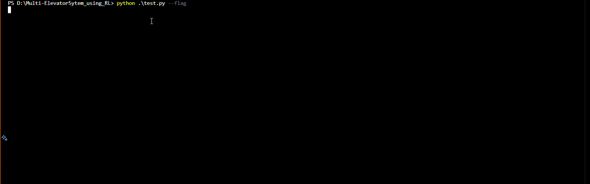

# Multi-ElevatorSytem_using_RL

## Project Overview

This project implements a reinforcement learning (RL) agent designed to optimize elevator operations within a multi-story building. The primary objective is to minimize passenger wait times and enhance overall system efficiency by enabling elevators to make intelligent, autonomous decisions.

The environment is modeled using OpenAI Gym and comprises:

- **Observation Space**: A dictionary containing of `Box`:
  - `floor_passengers`: A matrix representing the number of passengers waiting on each floor for each destination.
  - `elevator_floors`: An array indicating the current floor of each elevator.
  - `elevator_passengers`: A matrix detailing the number of passengers inside each elevator destined for each floor.

- **Action Space**: A `MultiDiscrete` space where each elevator can independently choose among four actions: `move up, move down, load passengers, or unload passengers`.

We employ the Proximal Policy Optimization (PPO) algorithm from `Stable Baselines3` to train the agent. PPO is well-suited for environments with complex, multi-discrete action spaces and provides stable and efficient learning performance.

## Installation

1. **clone the repo**  
     ```bash
     git clone https://github.com/dh-r-uv/Multi-ElevatorSytem_using_RL.git
     ```

2. **Create a Python virtual environment and activate it**  
   ```bash
   python -m venv ./.env
   ./.env/Scripts/activate
   ```
3. **Download the dependencies**
    ```bash
    pip install -r requirements.txt
   ```
## Usage

### Testing

- The current model on the test file is for a 2 elevator system with paramters: 
    - `capacity`: 8
    - `floor_capacity`: 8
    - `max_floor`: 6
- To run a random instance of `passengers(origin, dest)` run 
    ```bash
        python test.py
    ```
- To run a particular custom input on `input.txt`
- `input.txt` contains pairs of `origin, destination`, keep these between 1 and `max_floor`, also make sure the number of passengers waiting at a particular floor is less than equal to `floor_capacity` then run
    ```bash
        python test.py --flag
    ```
- To run with random spawn generation after every `utils.GENERATION_INTERVAL` we can run a flag
    ```bash 
        python test.py` --step_gen_flag
    ```

### Training
- Set your paramters for the environment and desired parameters in utils and run 
```bash
python agent.py
```
to train a model.
 
- Parameters that can be updated are
    ```python
        #utils.py
        SPAWN_PROB = 0.8
        PENALTY_OUTOFBOUNDS = 1
        PENALTY_USELESS = 1
        MAXSTEPS = 1000
        FINAL_REWARD = 500
        GENERATION_RATE = 6
        EPOCHS = 200
        HORIZONS = 2048
        TB_LOG_DIR = "./tensorboard_logs/"
    ```
and 
    ```python
    def make_env():
        return Building(
            elevator_count=2,
            max_floor=4,
            floor_capacity=5,
            elevator_capacity=5,
            render_mode="human"
        )
    ```

## Directory Structure
    ```
    multi-elevator/
    ├── environment/       # Building.py, Elevator.py, Passenger.py, utils.py
    ├── agent.py          
    ├── test.py          
    ├── 2Elevators        # model running 2 elevator system      
    ├── 3Elevators        # model running 3 elevator system
    ├── requirements.txt
    └── README.md
    ```

## Environment

- `Passenger.py`:
    - attributes are `idx`, `cur_floor`, `dest_floor`, `spawn_step`.

- `Elevator.py`:
    - attributes are `idx`, `capacity`, `passengers_in_elv`, `max_floor` and such.
    - methods are `up`, `down`, `load` and `unload`
- `Building.py`:
    - attributes are `elevators`, `floor_capacity`(max_number_of_people_in_a_floor), `elevators_capacity` and so on
    - Mainly maintains the `State` and `Action` spaces wrapped in `gym` spaces.

    - Contains methods like `reset()`, `step()`, `render()` and `_get_observation()` which are used by the PPO model of `stablebaselines3`. Implementations can be checked in `environment/Bulding.py`.

## Examples

- The code was run using `2 Elevator` model on the input file



